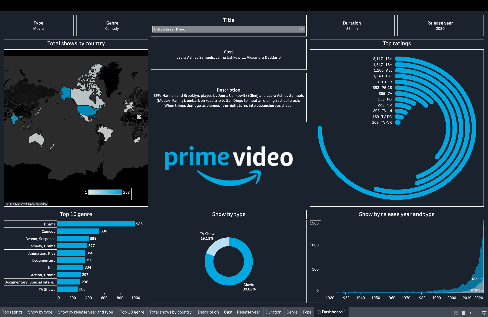

# Amazon-Prime-Video-Dashboard
Interactive Tableau Dashboard analyzing Amazon Prime Video's content strategy (genres, geographical distribution, film dominance) over more than 10 years.
Amazon Prime Video Content Strategy Analysis (Tableau Dashboard)

This project is a Tableau Dashboard analyzing data for Movies and TV Shows streamed on the Amazon Prime Video platform. The goal of the project is to identify the platform's content focus and genre preferences.

## 📊 Key Findings and Insights from the Dashboard

The visual analysis reveals the following key points:

* **Movie Dominance:** The main part of the catalog consists of Movies (80.52%), a common trend for streaming platforms.
* **Core Genre Focus:** "Drama" and "Comedy" are the most represented genres, indicating the platform appeals to a more traditional and mass audience.
* **Geographical Focus:** Content is primarily centered around **US** productions (indicated by the darkest blue color).

---

## 🛠 Tools Used

* **Visualization:** Tableau Desktop / Tableau Public
* **Data Source:** Amazon Prime Video content data (CSV file).

---

## 🔗 Project File Access

### 1. 🌐 Interactive Tableau Public Link (Recommended)

> **[Click Here for Live Dashboard View]:https://public.tableau.com/app/profile/nicat.sahmarov/vizzes
